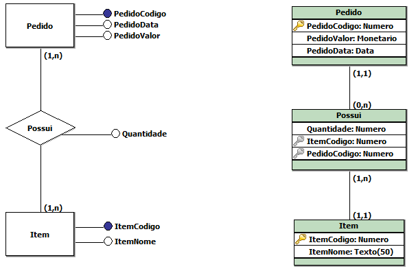

# Introdução

## Modelo Conceitual x Modelo Lógico



## SQL

```sql
CREATE TABLE PedidoGuilherme (
    PedidoCodigo INT CONSTRAINT PK_PedidoGuilherme PRIMARY KEY,
    PedidoValor MONEY,
    PedidoData DATE
)

INSERT PedidoGuilherme (PedidoCodigo, PedidoData, PedidoValor)
VALUES (1, '2019-11-30', 100.00);

SELECT * FROM PedidoGuilherme;

CREATE TABLE ItemGuilherme (
    ItemCodigo INT IDENTITY(1,1) CONSTRAINT PK_ItemGuilherme PRIMARY KEY,
    ItemNome CHAR(50)
)

INSERT ItemGuilherme (ItemNome)
VALUES ('MC Donalds');

SELECT * FROM ItemGuilherme;

UPDATE ItemGuilherme SET ItemNome = 'Mc Donalds' WHERE ItemCodigo = 1;

CREATE TABLE PedidoItemGuilherme (
    Quantidade INT,
    ItemCodigo INT,
    PedidoCodigo INT,
    FOREIGN KEY(ItemCodigo) REFERENCES ItemGuilherme (ItemCodigo),
    FOREIGN KEY(PedidoCodigo) REFERENCES PedidoGuilherme (PedidoCodigo)
)
```